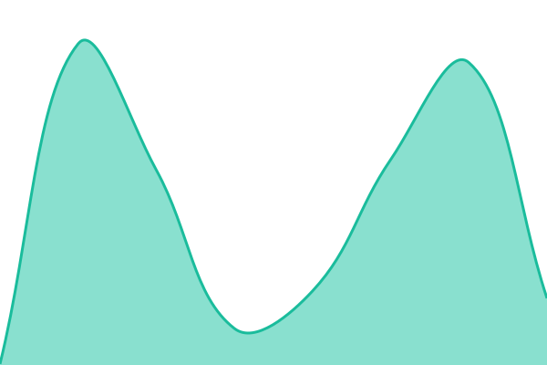
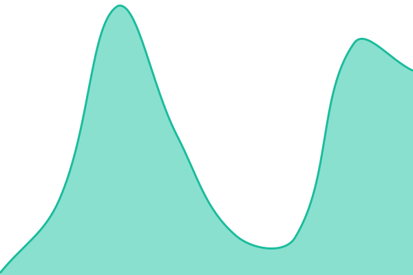

# [📈 Live Status](https://kockabence.github.io/upptime): <!--live status--> **🟧 Partial outage**

This repository contains the open-source uptime monitor and status page for [Bence Bartho](https://kockabence.github.io/upptime), powered by [Upptime](https://github.com/upptime/upptime).

With [Upptime](https://upptime.js.org), you can get your own unlimited and free uptime monitor and status page, powered entirely by a GitHub repository. We use [Issues](https://github.com/kockabence/upptime/issues) as incident reports, [Actions](https://github.com/kockabence/upptime/actions) as uptime monitors, and [Pages](https://kockabence.github.io/upptime) for the status page.

<!--start: status pages-->
<!-- This summary is generated by Upptime (https://github.com/upptime/upptime) -->
<!-- Do not edit this manually, your changes will be overwritten -->
<!-- prettier-ignore -->
| URL | Status | History | Response Time | Uptime |
| --- | ------ | ------- | ------------- | ------ |
|  [Google](https://www.google.com) | 🟩 Up | [google.yml](https://github.com/kockabence/upptime/commits/HEAD/history/google.yml) | 

 102ms
     
 | 

<a href="https://status.bencebartho.com/history/google">100.00%</a>
    

|  [Wikipedia](https://en.wikipedia.org) | 🟩 Up | [wikipedia.yml](https://github.com/kockabence/upptime/commits/HEAD/history/wikipedia.yml) | 

 306ms
     
 | 

<a href="https://status.bencebartho.com/history/wikipedia">100.00%</a>
    

|  [Reddit](https://www.reddit.com) | 🟥 Down | [reddit.yml](https://github.com/kockabence/upptime/commits/HEAD/history/reddit.yml) | 

 69ms
     
 | 

<a href="https://status.bencebartho.com/history/reddit">1.33%</a>
    

|  Jellyfin | 🟩 Up | [jellyfin.yml](https://github.com/kockabence/upptime/commits/HEAD/history/jellyfin.yml) | 

 2164ms
     
 | 

<a href="https://status.bencebartho.com/history/jellyfin">49.83%</a>
    

|  Plex | 🟥 Down | [plex.yml](https://github.com/kockabence/upptime/commits/HEAD/history/plex.yml) | 

 1972ms
     
 | 

<a href="https://status.bencebartho.com/history/plex">0.00%</a>
    

|  Audiobookshelf | 🟩 Up | [audiobookshelf.yml](https://github.com/kockabence/upptime/commits/HEAD/history/audiobookshelf.yml) | 

 1833ms
     
 | 

<a href="https://status.bencebartho.com/history/audiobookshelf">49.83%</a>
    

|  Jellyseerr | 🟥 Down | [jellyseerr.yml](https://github.com/kockabence/upptime/commits/HEAD/history/jellyseerr.yml) | 

 2214ms
     
 | 

<a href="https://status.bencebartho.com/history/jellyseerr">15.47%</a>
    

<!--end: status pages-->

[**Visit our status website →**](https://kockabence.github.io/upptime)

## 📄 License

- Powered by: [Upptime](https://github.com/upptime/upptime)
- Code: [MIT](./LICENSE) © [Anand Chowdhary](https://anandchowdhary.com), supported by [Pabio](https://pabio.com)
- Data in the `./history` directory: [Open Database License](https://opendatacommons.org/licenses/odbl/1-0/)
